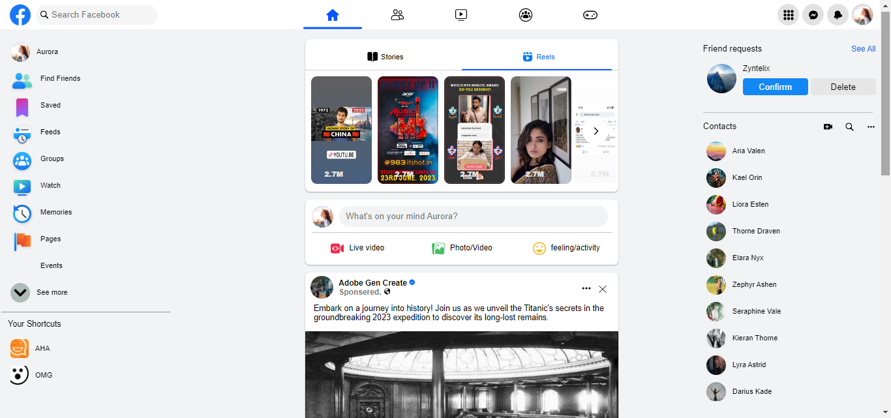
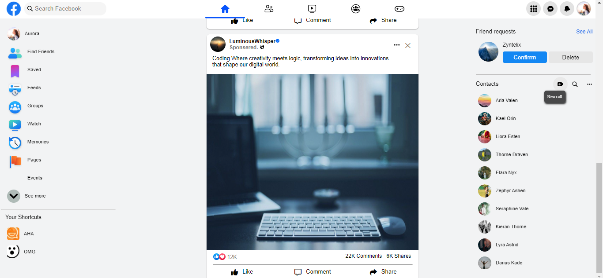

# Facebook Clone

## Description

This project is a simplified replica of the Facebook homepage, built using HTML and CSS. It aims to mimic the design and layout of Facebook's desktop interface.

## Features

- CSS styling inspired by Facebook's current UI.
- Functional hover effects and tooltips.
- Image and video content placeholders.

## Technologies Used

- HTML5
- CSS3

## Screenshots

## Credits

- Facebook logo image: [Facebook](https://www.facebook.com)
- Background images: Unsplash contributors

## License

This project is licensed under the MIT License - see the [LICENSE](LICENSE) file for details.

